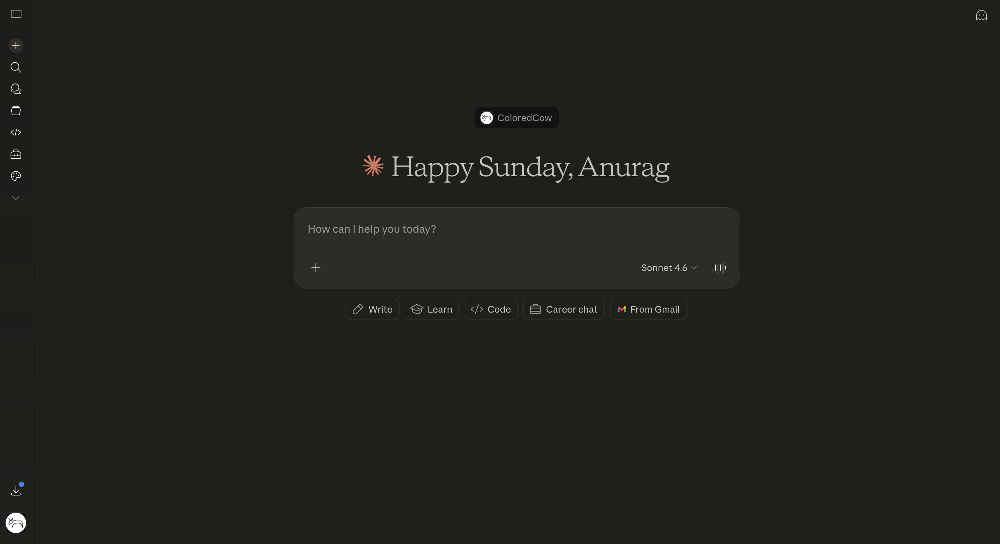
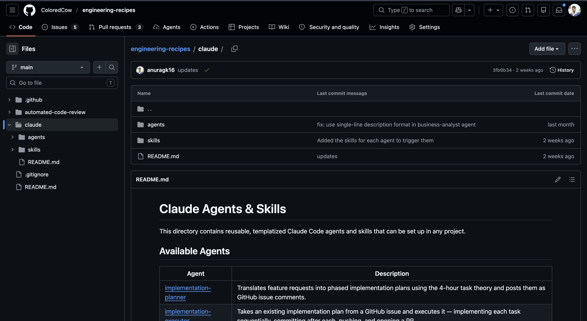
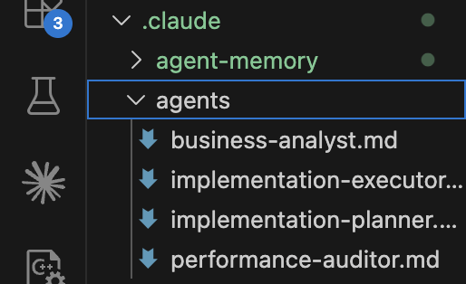
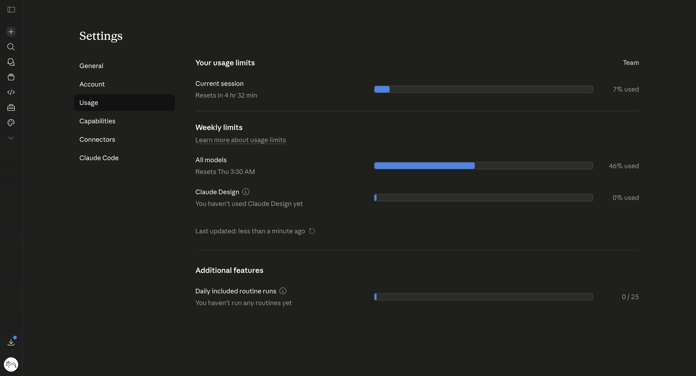
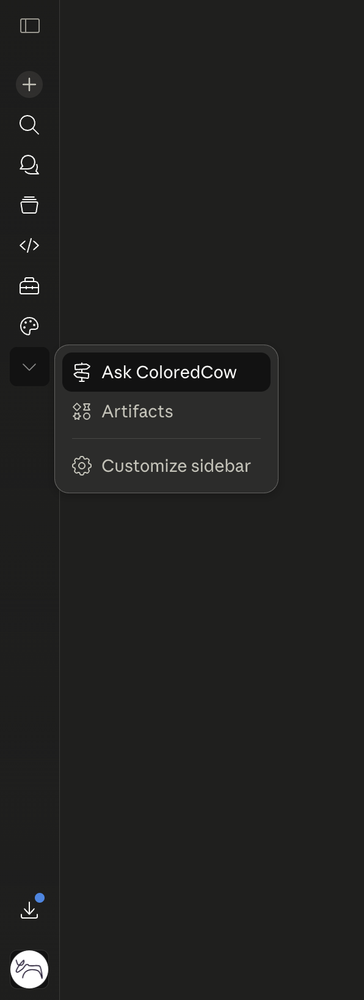
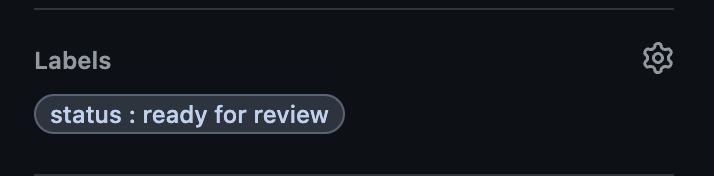

# Getting Started with AI at ColoredCow

ColoredCow is on a deliberate path to becoming an **AI-native organization** — not "a company that uses AI tools," but a team where AI is woven into how we think, plan, build, ship, and review. This guide is your starting kit. Treat it as ammunition: the more fluent you are with these tools, the more leverage you have on every project you touch.

Read it top to bottom before your first session. Then come back and contribute what you learn.

---

## Why this matters

We're not optimizing for "using AI sometimes." The bar is higher: every engineer at ColoredCow should be able to plan, code, debug, review, and ship faster *because* AI is part of the workflow, not in spite of it. Three things follow from that:

- **It's a skill, not a shortcut.** The engineers who go furthest are the ones who learn to prompt precisely, give Claude the right context, and know when *not* to use it.
- **Tool fluency compounds.** A small advantage in how you use Claude today turns into a large advantage on every feature, every PR, every incident.
- **What we build here, the team uses everywhere.** Agents, skills, prompt patterns — if it worked for your project, ship it back into [engineering-recipes](https://github.com/ColoredCow/engineering-recipes). That's how we move from "individuals using AI" to "an AI-native team."

And one more shift, maybe the most important:

- **AI is a thinking partner, not just a typing assistant.** Most of the industry uses AI to type faster — generate code, fill boilerplate, ship the obvious. We want to go further. Use Claude *before* the code: to pressure-test a design, sharpen a vague requirement, surface edge cases you'd miss, weigh trade-offs out loud. The biggest wins aren't in the lines of code AI writes — they're in the bad ideas it helps you catch before you write them.

> **What good looks like — the high-leverage AI-native engineer:**
> - Writes context-rich prompts (role, constraints, format) instead of one-line questions.
> - Uses Claude as a thinking partner, not just a typing assistant — pressure-tests designs, surfaces blind spots, argues trade-offs *before* writing code.
> - Picks the right model for the task — and knows when *not* to use AI at all.
> - Saves what works back into the repo as agents, skills, or prompt patterns.
> - Treats every API trigger as money spent — uses the tool deliberately, not casually.

---

## 1. Claude basics

If you've used ChatGPT before, Claude works similarly at the surface. A few things worth knowing upfront:

- Claude follows detailed instructions very well. The more context you give it, the better the output.
- Claude Chat is the starting point — open [claude.ai](https://claude.ai) and sign in with your work account.
- Claude Code is where most of the real engineering work happens — it has full context of your project folder. More on this in the next section.

**Opening Claude Chat:**



---

## 2. Claude Code and sub-agents

Claude Code is the CLI tool that connects Claude to your actual project. Once set up, Claude can read your folder structure, understand your codebase, and give you relevant answers instead of generic ones.

### Step 1 — Install Claude Code

Use the native installer for your OS. No Node.js required.

**macOS**
```bash
curl -fsSL https://claude.ai/install.sh | bash
```

**Linux**
```bash
curl -fsSL https://claude.ai/install.sh | bash
```

**Windows (PowerShell)**
```powershell
irm https://claude.ai/install.ps1 | iex
```

> **Windows tip:** Run this in PowerShell, not CMD. If you see `'irm' is not recognized`, you're in CMD — switch to PowerShell. If you prefer a Linux environment on Windows, install WSL first and then use the Linux command above inside it.

Verify the install:
```bash
claude --version
```

### Step 2 — Authenticate

Run `claude` in your terminal. On first launch it opens your browser — log in with your ColoredCow Google account (same one you use for [claude.ai](https://claude.ai)) and authorise. The session token is stored locally so you only do this once.


### Step 3 — Initialise Claude in your project

Navigate to your project folder, start Claude, and run the `/init` slash command:

```bash
cd your-project
claude
```

Then inside the Claude Code session:

```
/init
```

`/init` reads your entire project structure and creates a `CLAUDE.md` file. This is the most important file — Claude reads it first on every session to understand your project context.


### Step 4 — Set up the ColoredCow agents and skills

Three production agents live in the [engineering-recipes repo](https://github.com/ColoredCow/engineering-recipes) under the `/claude/` folder — Business Analyst, Implementation Planner, Implementation Executor. Each agent ships with a companion **skill** (`cc-business-analyst`, `cc-implementation-planner`, `cc-implementation-executor`) that guarantees the agent is invoked correctly and shows live progress in the terminal. Install agents and skills together.

**To add them to your project:**

1. Open [`claude/README.md`](https://github.com/ColoredCow/engineering-recipes/blob/main/claude/README.md) — single source of truth for the setup prompt
2. Copy the setup prompt from the **Prompt** section
3. Paste it into your Claude Code session — it replaces placeholders with your project's context and creates all three agents and their companion skills automatically



Once done, type `/agents` in Claude Code to see the three agents listed under your project.



### The three agents

**Business Analyst**
Converts a vague 2–3 line requirement into a fully scoped document. Give it the GitHub issue URL — it reads the codebase, asks open questions where context is missing, and produces a final requirement with purpose, scope, acceptance criteria, and open questions.

```
# Example usage in Claude Code
Use the business-analyst agent.
Issue: https://github.com/your-org/your-project/issues/123
Don't assume anything. Post all open questions first.
```

**Implementation Planner** *(recommended: Opus)*
Takes a refined requirement and produces a full technical plan — frontend/backend file-level changes, DB impact, task breakdown using the 4-hour theory, and a testing strategy. Review the plan before handing it to the executor.

```
# Example usage in Claude Code
Use the implementation-planner agent.
Requirement: [paste refined requirement here]
```

**Implementation Executor** *(recommended: Sonnet)*
Takes an approved implementation plan and executes it — creates a checklist, syncs the branch, implements changes file by file, and pushes. Only use this after the plan has been reviewed.

```
# Example usage in Claude Code
Use the implementation-executor agent.
Plan: [paste approved plan here]
```

> **Note:** If your project (IGS, Sneha, Spark) already has Claude set up, skip Steps 3 and 4 — open Claude Code from the project folder and the agents are already there.

---

## 3. Contribute back — this is the loop

Becoming AI-native is not something the company does *to* you — it's something you do, and then ship back. When you build a new agent, find a prompt pattern that consistently works, or identify a gap, get it into the engineering recipes repo. That's the loop that turns "individuals using AI" into "an AI-native team."

**Areas with no agents yet (open invitations):** SEO, DevOps, Playwright/Cypress, QA automation patterns, performance auditing.

To contribute:
- Make your agent generic (project-specific context goes in placeholders, not hardcoded)
- Open a PR in [ColoredCow/engineering-recipes](https://github.com/ColoredCow/engineering-recipes)
- Tag it with `agent` or `skill` accordingly

The repo grows because we feed it. When it works for you, ship it back — the next engineer shouldn't have to rediscover what you already figured out.

---

## 4. Limits, models, and prompting

### Session and weekly limits

- You have a **per-session limit** (~4–5 hours of active usage)
- You have a **weekly limit** on top of that
- Claude Code shows a warning at 90% usage — plan accordingly



### Which model to use

Choosing the right model is itself a skill — pick deliberately, not by default. Bigger isn't better; the right model is the smallest one that handles the task well.

| Use case | Model |
|---|---|
| Planning, research, complex reasoning | **Opus** |
| Coding, execution, implementation | **Sonnet** |
| Quick lookups, simple Q&A, fast iteration | **Haiku** |

**Extended thinking** is available on all models. Enable it when normal prompting isn't giving you a clean solution — it gives Claude extra time to reason before responding.

### Prompting tips

- **Give it a role:** "You are a senior backend engineer working on a multi-tenant SaaS app."
- **Be explicit about format:** Tell it exactly what you want — bullet points, a table, JSON, a numbered plan.
- **Use XML tags for large inputs:** Wrap code, docs, or long text in `<document>` tags so Claude processes it cleanly.
- **Ask for step-by-step reasoning:** Adding "think step by step" improves output quality on complex tasks.
- **Iterate in the same conversation:** Claude remembers the full context. Don't start a new chat — just refine in place.

---

## 5. Ask ColoredCow

ColoredCow ships a custom Google Chat integration that lets you query your project's Google Chat history directly from Claude — useful when you need to recover context from past discussions without scrolling through threads.

### Connecting it

1. Open [claude.ai](https://claude.ai)
2. Go to connectors / available apps
3. Find **ColoredCow Google Chat** and click Connect
4. Authenticate with your work Google account



### Using it

Once connected, ask things like:

- *"Summarise all activity in the Sneha LMS Google Chat space from the last week"*
- *"What deployments were discussed in the past month on this project?"*
- *"Find the discussion we had about CI/CD workflow in March"*

---

## 6. Two accounts, two cost models

ColoredCow runs **two separate Claude setups** and they're billed differently. Knowing which is which is part of using AI responsibly here.

| | Team account | Code review API |
|---|---|---|
| What it is | claude.ai team subscription | Anthropic API used in our GitHub workflow |
| Who pays | ColoredCow | ColoredCow — per API call |
| What it's for | Your daily use, sub-agents, Claude Code | Automated PR code reviews |
| How to access | Sign in at claude.ai | Triggered by the `ready for review` label on a PR |

**Use the code review tool responsibly.** Every trigger of the `ready for review` label calls the Anthropic API and adds to ColoredCow's bill. We're at a stage where cost discipline matters — the goal is to use AI more, not waste it. Trigger reviews when a PR is genuinely ready: tested, self-reviewed, and worth a senior pair of eyes. Skip it for drafts, WIP, or trivial changes you can review yourself.



---

## 7. Keep exploring other tools

Claude is primary. Other tools have edges — Codex on execution, Cursor on inline editing, others on niches we haven't mapped yet. Strategic curiosity is part of the job: an AI-native engineer doesn't pledge loyalty to one vendor, they run tools in parallel and develop taste.

The team currently uses:
- **Claude** — planning, agents, complex reasoning
- **Codex** — execution and implementation (saves Claude credits)

Run them in parallel on real work. Notice where each one wins. Bring what you learn back to the team — that's how the playbook stays sharp.

---

*To update this doc — open a PR in [ColoredCow/engineering-recipes](https://github.com/ColoredCow/engineering-recipes). Don't let it go stale.*